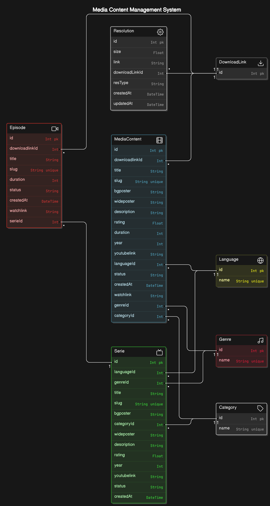

# Film & Series Central

Welcome to Film & Series Central – your ultimate destination for discovering, watching, and reviewing movies and series from around the world. This web application leverages modern technologies to provide a seamless user experience while exploring the vast landscape of cinematic content.

## Features

- **Browse Movies and Series**: Explore a diverse catalog of films and series across various genres, languages, and categories.
- **Search Functionality**: Easily find your favorite titles using a powerful search feature that filters results by genre, language, and more.
- **Detailed Information**: Get in-depth details about each title, including descriptions, ratings, trailers, and more.
- **Responsive Design**: Enjoy a mobile-friendly interface that looks great on any device.

## Technologies Used

- **Frontend**: Built with **Next.js 14**, offering server-side rendering and a fast user experience.
- **Backend**: Utilizes **Prisma** as an ORM to interact with the database, making data management intuitive and efficient.
- **Database**: Hosted on **Supabase**, leveraging PostgreSQL for robust and scalable data storage.
- **Deployment**: Easily deployable on platforms like Vercel, ensuring quick and reliable access for users.

### Database Schema

The backend uses **Prisma ORM** to manage the database schema. This includes models for **movies**, **series**, and other key entities in the site.

Below is a visual representation of the database schema:

This image gives an overview of the relationships between different models in the system.

